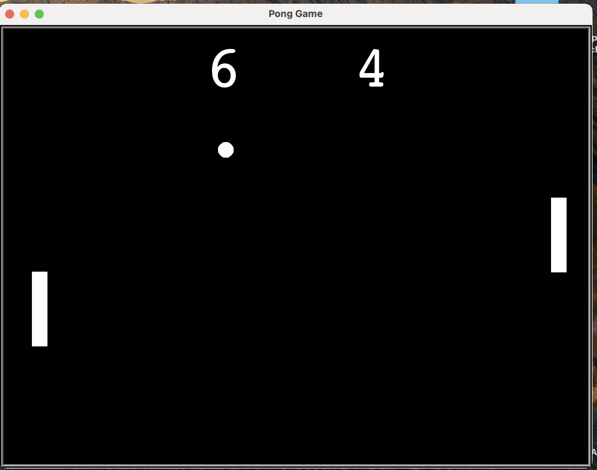

# 🕹️ Pong Game (Python Turtle)

This is a fully functional and enhanced **Pong game** built using Python’s built-in **Turtle graphics** module.  
A **human player** (right paddle) competes against an **AI-controlled** left paddle. The game features dynamic scoring,
  **high score tracking**, **sound effects**, and engaging **start and end screens**.

## 🚀 Features

- ✅ **Single-player mode** with basic AI opponent  
- ✅ Real-time **ball movement** with wall and paddle **collision detection**  
- ✅ Dynamic **score tracking** with on-screen **scoreboard**  
- ✅ **Persistent high score** tracking  
- ✅ **Start screen** with game instructions and ASCII splash art  
- ✅ **End screen** with **winner announcement** and game summary  
- ✅ **Sound effects** on collisions and scoring  
- ✅ **Modular, object-oriented** Python codebase  

## 📁 Project Structure
PongGame/

├── main.py # Main game logic and loop

├── paddle.py # Paddle class for player and AI paddle

├── ball.py # Ball class for movement, collision, and reset logic

├── scoreboard.py # ScoreBoard class for tracking scores and high score

├── screen_setup.py # Start and end screen drawing logic

├── sound.py # SoundEffects class for collision and scoring sounds

└── README.md # Project documentation (you are here)

## 🧰 Technologies Used
- Python 3
- Turtle (built-in Python module)

## 🎮 Controls

###  AI (**Left Paddle**)
- Automatically controlled with random decision-making for realism

### Right Paddle
- Move Up: `Up Arrow (↑)`
- Move Down: `Down Arrow (↓)`

## ▶️ How to Run

1. Make sure you have Python 3 installed.
2. Clone this repository:
   git clone https://github.com/Tushar-Sharma10/Python-Pong-Game.git
   cd PongGame
3. python main.py

## Completed Improvements
1.) Added sound effects for scoring and collisions

2.) Implemented AI-controlled paddle for single-player mode

3.) Created start and end screens with winner announcement

4.) High score tracking and display

